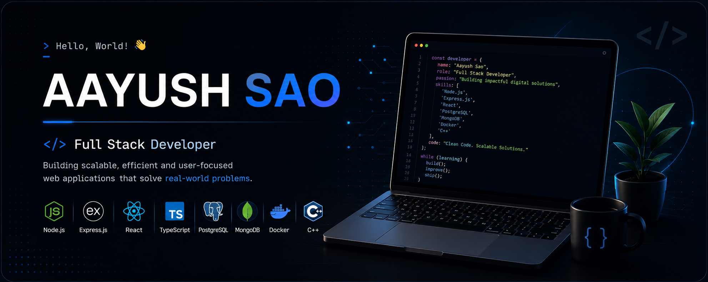

  

<h1 align="center">Hi 👋, I'm Aayush Sao</h1>

<h3 align="center">
Full Stack Developer • Backend Enthusiast • C++ Programmer
</h3>

  

  
  
  

---

# 👨‍💻 About Me

🚀 Currently building **Production-Ready Backend Projects**

🌱 Learning **React, System Design, Docker & Advanced Backend**

💻 Passionate about **Backend Development & Problem Solving**

🧠 Practicing **Data Structures & Algorithms**

💬 Ask me about

- C++
- JavaScript
- Node.js
- Express.js
- PostgreSQL
- MongoDB
- JWT
- Drizzle ORM
- REST APIs

📫 Reach me at

**asao4393@gmail.com**

---

# 🚀 Tech Stack

---

# 🌐 Connect With Me

&nbsp;&nbsp;&nbsp;&nbsp;

&nbsp;&nbsp;&nbsp;&nbsp;

---

# 📊 GitHub Statistics

---

# 🔥 GitHub Streak

---

# 📈 Contribution Graph

---

# 💼 Currently Building

🚀 **Production Ready URL Shortener**

- Node.js
- Express.js
- PostgreSQL
- JWT Authentication
- Drizzle ORM
- Docker

# 💡 Developer Philosophy

> *"Write clean code. Learn continuously. Build projects that solve real-world problems."*

---

<h3 align="center">

⭐ If you like my work, consider giving a star to my repositories!

</h3>
